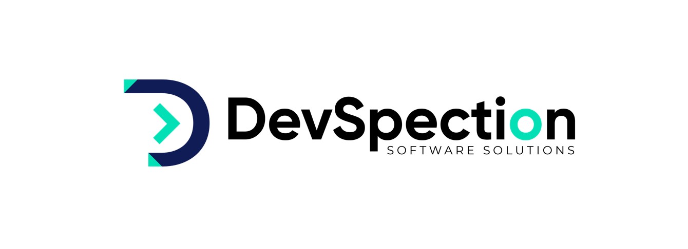

<h1 align="center"> Hi there 👋 We are devSpection.</h1>
<h3 align="center">Providing complete Software Solutions for your Ideas💻</h3>

  

**🔭 About Us**

 At devSpection, we believe in promoting a healthy work-life balance for our employees, which is why we offer a remote work policy. As a fully remote company, we understand that our employees have different work styles, schedules, and environments that enable them to be productive and successful.

**🌱 Our growing Prospective**

 At devSpection, we are passionate about empowering businesses with innovative software solutions. As a leading software development service provider, we specialize in creating custom software applications, mobile apps, and web-based solutions that help our clients streamline their operations and achieve their business goals. Whether you need to improve your existing software or build something new from scratch, devSpection is your trusted partner for all your software development needs.

🤝 **Our Mission**

 Unwavering commitment to Technological advancement our mission is to pioneer innovation in the realm of AI and software development, creating transformative solutions that empower businesses and individuals to reach new heights of excellence and user-centric design.

😊 **Our services**
- Artificial Intelligence
- Natural processing Language
- Generative AI
- Predictive Modelling
- Machine learning
- WordPress development
- Web development

👨‍💻 **Our Projects**
All of our projects are available at [https://github.com/devSpection](https://github.com/devSpection)

📝 **Our Blogs**
Find out our regularly written articles on [https://medium.com/@devspection](https://medium.com/@devspection)

🔍 **Find Us**
https://www.linkedin.com/company/devspection/

📫 **Reach us**
info@devspection.com

🎯 **our experiences**
[www.devspection.com](www.devspection.com)

👀 **We ''re looking for**
Motivated individuals, with diverse skills.

<h3 align="center">Languages and Tools:</h3>

  
  
  
   
   
   
   
   
   
  
  
  
  
   
  
   
  
   
   
  
   
   
   
  

